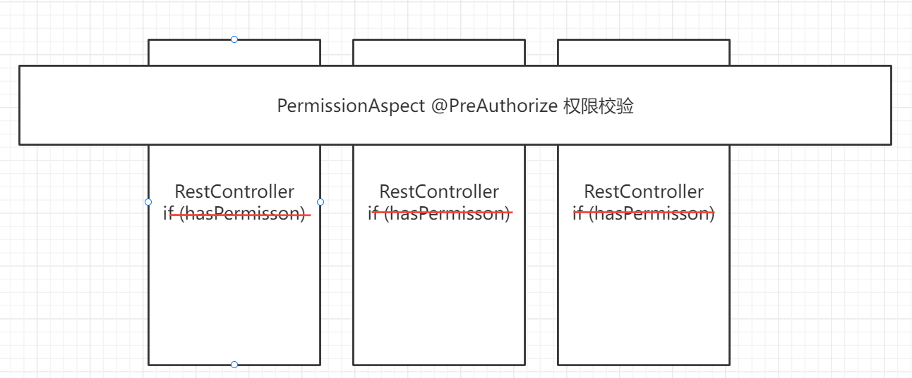

# 一.简介

本项目是一个深入学习Spring核心原理的项目暨毕业设计作品,本想介绍了常见的IoC,AOP设计思想和MVC,ORM设计范式,通过本项目你可以了解到如何自行实现上述设计思想,提高架构思维.

# 二. IoC设计思想

## 2.1 什么是IoC?

**IoC**是**Inversion of Control**的缩写,也叫**控制反转**.
 为什么要有控制反转?

这是因为软件设计的原则是"**高内聚、低耦合**",为了解耦,工业内使用了很多手段,如现在如火如荼的微服务架构,就是从软件架构去解耦合来达到性能提高和业务切分的目的.在每个SpringBoot的应用中,我们也会用到IOC来解决对象与对象之间的耦合问题.(需求每时每刻都有可能变化,我们设计的系统要去拥抱变化,所以要保持扩展性)

## 2.2 IoC的作用

1. 控制反转是应用于软件工程领域的,在运行时被装配器对象用来绑定耦合对象的一种编程技巧,对象之间的耦合关系在编译时通常是未知的.在传统的编程方式中,业务逻辑的流程是由应用程序中早已被设定好关联关系的对象来决定的.在使用控制反转的情况下,业务逻辑的流程是由对象关系图来决定的,该对象关系图由装配器负责实例化,这种实现方式还可以将对象之间的关系的定义抽象化.绑定的过程是通过"依赖注入"实现的.
2. 控制反转是一种以给予应用程序中目标组件更多控制为目的的设计范式,并在实际工作中起到了有效的作用.
3. 依赖注入是在编译阶段尚未知所需的功能是来自哪个的类的情况下,将其他对象所依赖的功能对象实例化的模式.这就需要一种机制来激活相应的组件以提供特定的功能,所以依赖注入是控制饭庄的基础.否则如果在组件不收框架控制的情况下,框架又怎么知道创建哪个组件?

## 2.3 IoC的核心思想

我们在需要某个实例的时候,我们告诉IOC,我们需要什么对象即可,由IOC帮我们装配好对象然后通过"注入"的方式给到我们,这个方式可以是Setter、Constructor、Interface、Annotation.(例子:Spring工程中的`@Autowired`和`@Resource`)
 那么我们来解答控制反转是什么进行了反转?——我们原本需要自己创建对象,现在我们将这个工作交给IOC来做.由IOC来创建了对象.

> 依赖倒转前:

> 依赖倒转后:

# 三. AOP设计思想

## 3.1 什么是AOP?

​	面向切面编程（**AOP**是**Aspect Oriented Program**的首字母缩写） ,我们知道,面向对象的特点是继承、多态和封装.而封装就要求将功能分散到不同的对象中去,这在软件设计中往往称为职责分配.实际上也就是说,让不同的类设计不同的方法.这样代码就分散到一个个的类中去了.这样做的好处是降低了代码的复杂程度,使类可重用.
​	但是人们也发现,在分散代码的同时,也增加了代码的重复性.什么意思呢？比如说,我们在两个类中,可能都需要在每个方法中做日志.按面向对象的设计方法,我们就必须在两个类的方法中都加入日志的内容.也许他们是完全相同的,但就是因为面向对象的设计让类与类之间无法联系,而不能将这些重复的代码统一起来.

​	也许有人会说,那好办啊,我们可以将这段代码写在一个独立的类独立的方法里,然后再在这两个类中调用.但是,这样一来,这两个类跟我们上面提到的独立的类就有耦合了,它的改变会影响这两个类.那么,有没有什么办法,能让我们在需要的时候,随意地加入代码呢？**这种在运行时,动态地将代码切入到类的指定方法、指定位置上的编程思想就是面向切面的编程.** 
​      一般而言,我们管切入到指定类指定方法的代码片段称为切面,而切入到哪些类、哪些方法则叫切入点.有了AOP,我们就可以把几个类共有的代码,抽取到一个切片中,等到需要时再切入对象中去,从而改变其原有的行为.
​	这样看来,AOP其实只是OOP的补充而已.OOP从横向上区分出一个个的类来,而AOP则从纵向上向对象中加入特定的代码.有了AOP,OOP变得立体了.如果加上时间维度,AOP使OOP由原来的二维变为三维了,由平面变成立体了.从技术上来说,AOP基本上是通过代理机制实现的. 

​	AOP在编程历史上可以说是里程碑式的,对OOP编程是一种十分有益的补充.

## 3.2 AOP的实现

​	**AOP不一定都像Spring AOP那样,是在运行时生成代理对象来织入的,还可以在编译期、类加载期织入,比如AspectJ.**

​	**AOP像OOP一样,只是一种编程范式,AOP并没有规定说,实现AOP协议的代码,要用什么方式去实现.**

第一种方式,我可以采用**代理模式**,

代理分为**静态代理**和**动态代理**,静态代理,顾名思义,就是你自己写代理对象,动态代理,则是在运行期,生成一个代理对象.

**Spring AOP就是基于动态代理的**,如果要代理的对象,实现了某个接口,那么Spring AOP会使用**JDK Proxy**,去创建代理对象,而对于没有实现接口的对象,就无法使用JDK Proxy去进行代理了（为啥？你写一个JDK Proxy的demo就知道了）,这时候Spring AOP会使用**Cglib**,生成一个被代理对象的子类,来作为代理,放一张图出来就明白了：

**但是不是所有AOP的实现都是在运行时进行织入的,因为这样效率太低了**,而且只能针对方法进行AOP,无法针对构造函数、字段进行AOP.

**我完全可以在编译成class时就织入啊,比如AspectJ**,当然AspectJ还提供了后编译器织入和类加载期织入,这里我就不展开讨论了.

## 3.3 AOP的例子

**1. 权限校验的AOP体现：**

**AOP**意思就是面向切面编程,可以用一句话概况AOP编程思想,即横向重复,纵向抽取.我们知道,软件工程一个基本原则就是代码复用,为了实现这个目标,我们可以用类,用方法,同样,AOP也是代码复用的一种方式.我们现在用下面这样一种例子来具体解释什么叫做面向切面编程.开发过权限管理系统的朋友肯定知道在校验权限的时候可以封装一个权限切面鉴权,而不用每次都判断是否有权限,省去了大量的 if 判断.

**2. Spring框架中的AOP思想体现**

在Spring框架中,一个典型的例子就是service层中的事务管理,没一个service层都需要实现事务管理的代码,这就是所谓横向重复,spring能够为容器中的对象生成动态代理对象（spring中使用动态代理技术实现AOP）,通过这个代理对象能够纵向管理事务操作.

# 四. MVC设计范式

MVC 模式代表 Model-View-Controller（模型-视图-控制器） 模式。这种模式用于应用程序的分层开发。

- **Model（模型）** - 模型代表一个存取数据的对象或 JAVA POJO。它也可以带有逻辑，在数据变化时更新控制器。
- **View（视图）** - 视图代表模型包含的数据的可视化。
- **Controller（控制器）** - 控制器作用于模型和视图上。它控制数据流向模型对象，并在数据变化时更新视图。它使视图与模型分离开。

MVC 设计不仅限于 [Java](http://c.biancheng.net/java/) Web 应用，还包括许多应用，比如前端、[PHP](http://c.biancheng.net/php/)、.NET 等语言。之所以那么做的根本原因在于解耦各个模块。

MVC 是 Model、View 和 Controller 的缩写，分别代表 Web 应用程序中的 3 种职责。

- 模型：用于存储数据以及处理用户请求的业务逻辑。
- 视图：向控制器提交数据，显示模型中的数据。
- 控制器：根据视图提出的请求判断将请求和数据交给哪个模型处理，将处理后的有关结果交给哪个视图更新显示。

基于 [Servlet](http://c.biancheng.net/servlet/) 的 MVC 模式的具体实现如下。

- 模型：一个或多个 JavaBean 对象，用于存储数据（实体模型，由 JavaBean 类创建）和处理业务逻辑（业务模型，由一般的 Java 类创建）。
- 视图：一个或多个 [JSP](http://c.biancheng.net/jsp/) 页面，向控制器提交数据和为模型提供数据显示，JSP 页面主要使用 HTML 标记和 JavaBean 标记来显示数据。
- 控制器：一个或多个 Servlet 对象，根据视图提交的请求进行控制，即将请求转发给处理业务逻辑的 JavaBean，并将处理结果存放到实体模型 JavaBean 中，输出给视图显示。

# 五. ORM设计范式

对象关系映射（Object Relational Mapping，简称ORM）是一种程序技术，用于实现面向对象编程语言里不同类型系统的数据之间的转换。从效果上说，它其实是创建了一个可在编程语言里使用的“虚拟对象数据库”。

- O(对象模型)：实体对象，即我们在程序中根据数据库表结构建立的一个个实体Entity。

- R(关系型数据库的数据结构)：即我们建立的数据库表。
- M(映射)：从R（数据库）到O（对象模型）的映射，可通过XML文件映射。

ORM框架自动实现Entity实体的属性与关系型数据库字段的映射。CRUD的工作则可以交给ORM来自动生成代码方式实现。隐藏了数据访问细节，“封闭”的通用数据库交互，他使得我们的通用数据库交互变得简单易行，并且完全不用考虑SQL语句。大大提高我们开发效率， 这样一来也减少我们维护一个复杂 缺乏灵活性数据访问层的成本。

缺点：
  帮助我们开发人员跟踪实体的变化,并将实体的变化翻译成sql脚本,执行到数据库中去,也就是将实体的变化映射到了表的变化。这样会给我们带来非常大的便利。但有得必有失，便利的同时也无可避免的带来了一些其他的问题：比如 性能降低，复杂的查询ORM仍然力不从心等。

不得不说，任何优势的背后都隐藏着缺点，这是不可避免的。问题在于，我们是否能容忍这些缺点。这需要结合项目的具体情况考虑使用这项技术是否利大于弊 。

具体实现这种思想的框架已有很多，JPA，Herberate，MyBatis，这些框架都大同小异。